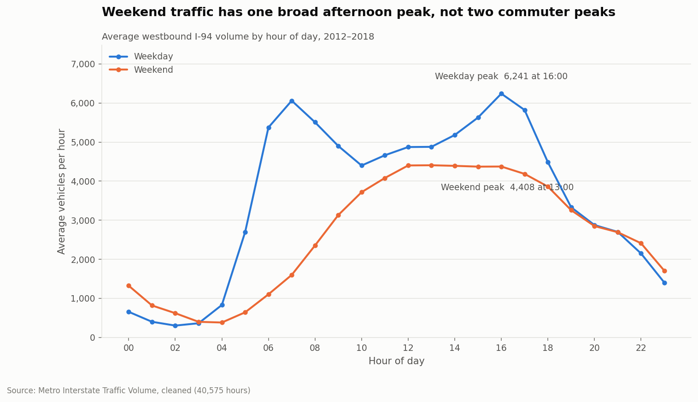
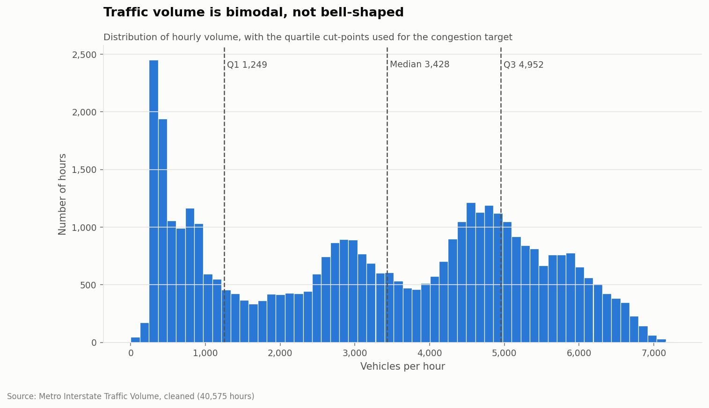
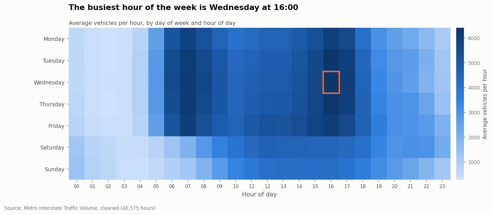
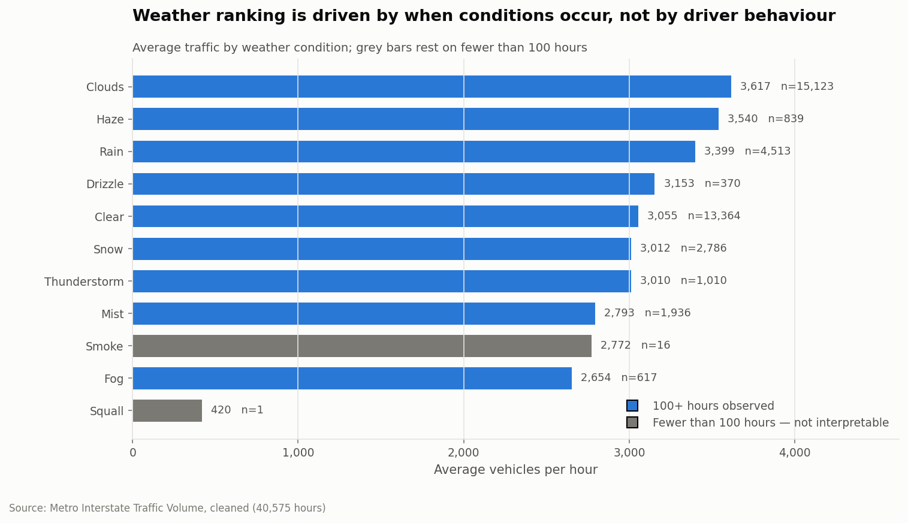
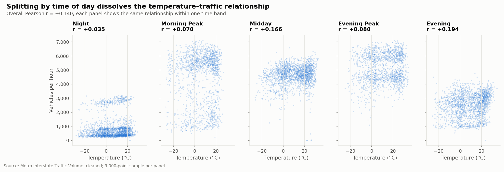
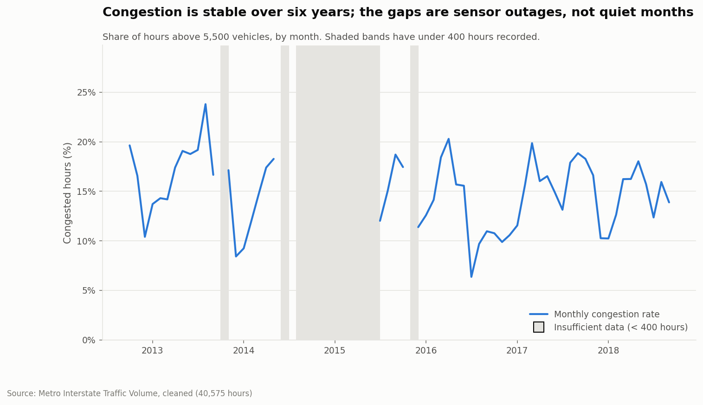

# Part 2, Task 3 — Figure interpretations

Generated by `part2_python/visualizations.py`. Each figure below is saved in this directory.

## Figure 1 — Hourly demand: weekday versus weekend

**File:** `01_hourly_weekday_vs_weekend.png`

The two curves have fundamentally different shapes. Weekdays show the classic twin-peak commuter profile: volume climbs steeply from 04:00 to a morning peak of 6,061 vehicles/hour at 07:00, falls back to 4,401 at 10:00, then builds again to the true daily maximum of 6,241 at 16:00. The afternoon peak is the larger of the two, by 3%, which is worth stating plainly because traffic policy conventionally treats the morning commute as the binding constraint. On this corridor it is not. Weekends have no morning peak whatsoever: volume rises gradually to a single broad plateau of 4,408 vehicles/hour around 13:00, 1.42x below the weekday maximum, and decays slowly through the evening. The practical consequence is that weekday and weekend demand cannot be served by one timing policy — any model that ignores day type will be systematically wrong on two days in seven. This is why 'is_weekend' and the cyclical hour encoding are both in the feature set.

## Figure 2 — Distribution of hourly traffic volume

**File:** `02_traffic_volume_distribution.png`

The distribution has two distinct masses rather than a single central tendency: a tall spike of near-empty overnight hours below roughly 1,000 vehicles, and a broad daytime mass between about 4,000 and 6,000. Almost nothing sits in between. This matters more than it first appears. The mean (3,291) and the median (3,428) both fall in the sparse valley between the two modes, so neither describes a typical hour — there is no typical hour on this corridor, only typical nights and typical days. Reporting 'average traffic' to a stakeholder without this caveat is actively misleading. It also explains the negative excess kurtosis of -1.31 found in Part 1: the distribution is flatter than normal because its mass sits at the two ends. The dashed lines show the quartile cut-points (Q1 1,249, median 3,428, Q3 4,952) that define the four-level congestion target used in Part 3; splitting on quartiles rather than fixed thresholds guarantees four balanced classes despite this awkward shape.

## Figure 3 — Traffic intensity by hour and day of week

**File:** `03_hour_day_heatmap.png`

The heatmap separates two effects the hourly average conflates. Reading across, Monday to Friday share an almost identical signature — a firm morning block at 06:00–08:00 and a wider, darker afternoon block from 14:00 to 18:00. Reading down, the weekend rows lose the morning block entirely and shift their mass into the middle of the day. The single busiest cell of the week is Wednesday at 16:00, averaging 6,414 vehicles/hour, which is 1.38x the Saturday maximum of 4,651. Wednesday afternoon is therefore the correct target for any intervention aimed at the worst hour of the week, rather than the Monday morning commute that traffic policy conventionally focuses on. Note also the faint vertical band at 05:00 across all seven rows: the corridor wakes up at the same time regardless of day type, but only fills up on weekdays.

## Figure 4 — Average traffic by weather condition

**File:** `04_weather_impact.png`

Among conditions with enough observations to interpret, Clouds carries the highest average traffic at 3,617 vehicles/hour and Fog the lowest at 2,654, a gap of 963. It is tempting to read this as drivers responding to weather. That reading is wrong, and the chart is deliberately labelled to resist it. Cloud is the default daytime condition in Minneapolis while clear skies are disproportionately nocturnal, so this ranking largely encodes what time of day each condition tends to occur. Part 1 demonstrates this directly: the raw odds ratio makes congestion look 26% less likely in clear weather, yet holding hour of day constant shrinks the clear-versus-cloudy difference to +0.03 percentage points. The greyed bars carry the second lesson — Squall rests on a single observed hour, so its apparent position at the bottom of any ranking is an artefact of sample size, not a finding.

## Figure 5 — Temperature versus traffic, by part of day

**File:** `05_temperature_vs_traffic_by_daypart.png`

Pooled across all hours, temperature and traffic correlate at r = +0.140 — weak, but positive and highly significant given 40,575 observations. Faceting by time of day shows why that number should not be trusted as a behavioural finding. Each panel is a horizontal cloud: within any given time band, knowing the temperature tells you very little about how many vehicles are on the road. The pooled correlation arises almost entirely from the fact that warm hours and busy hours are both daytime summer hours. This is a textbook illustration of why correlation does not imply causation, and a concrete warning for the models in Part 3: temperature will appear in the feature set, but any importance it receives should be read as a proxy for season and daylight rather than as evidence that drivers respond to the thermometer.

## Figure 6 — Monthly congestion rate, 2012–2018

**File:** `06_congestion_rate_over_time.png`

Across the months with adequate coverage the congestion rate sits in a narrow band between 6.4% and 23.8% of hours, with no visible trend over six years: this corridor's congestion problem is stable and structural rather than growing. The shaded bands are the reason this figure exists in its current form. 14 of 72 months have fewer than 400 recorded hours, and an earlier draft that plotted them as ordinary points produced a dramatic-looking collapse through 2014 and 2015 that was entirely an artefact of sensor downtime. Masking them and shading the gap is the honest presentation. Any dashboard built for the mobility team should adopt the same convention, because a stakeholder who sees an unmarked dip will reasonably conclude that demand fell.
